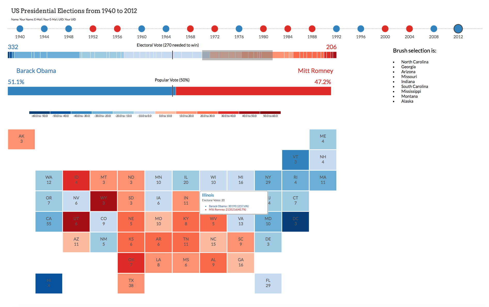
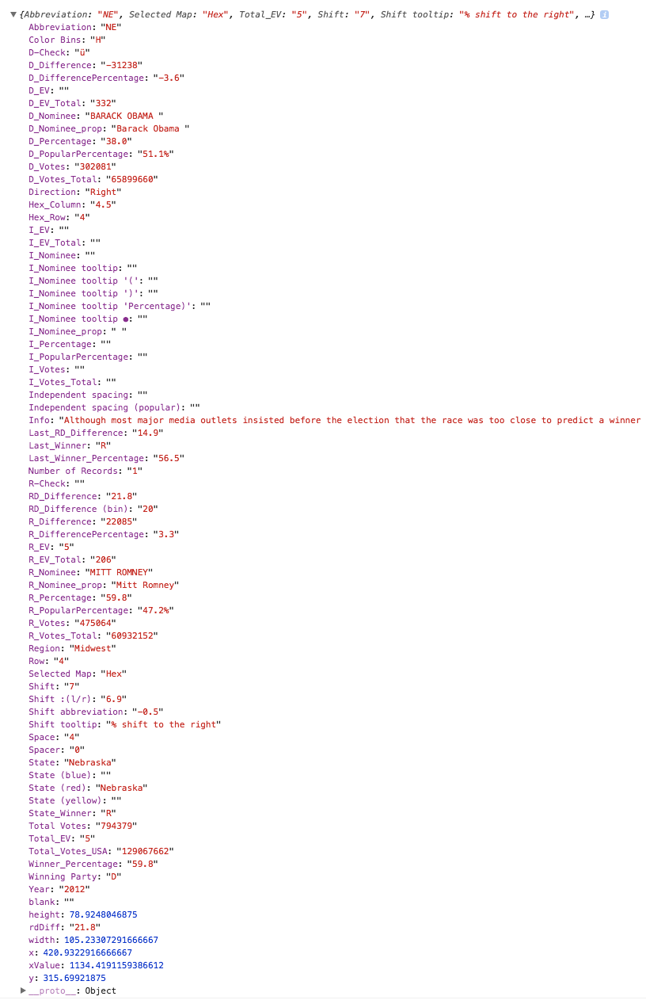
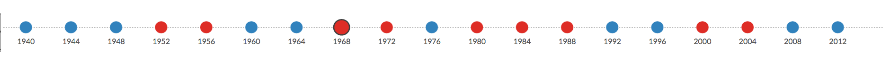
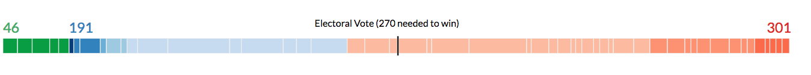
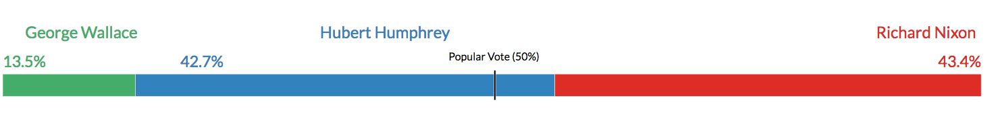
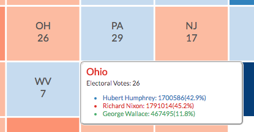

# CS-5630 / CS-6630 Homework 6
*Due: Friday, October 27, 11:59 pm.* 

In this assignment you will use your existing knowledge of creating basic visualizations from the previous assignments to create custom visualizations. You will also learn to organize your code and to work with brushes. These visualizations are linked to each other and display statistics from US Presidential Election data dating back to 1940.

## Visualization design

We are going to visualize the election outcomes and the contribution of different states over multiple years. You will be able to see the outcomes for the Democratic and Republican parties, as well as for the rare independent winner (independents are rare though, as they have to win a state to show up in our visualization). This will be done using three charts:

The **year chart** allows you to visualize different election years where you can select a specific year to explore.

The **electoral vote chart** visualizes the wining party and the number of electoral votes corresponding to each state

The **vote percentage chart** displays the percentage of votes won by each party and independent candidates in some cases.

The **tile chart** visualizes the same data as the electoral vote chart, but provides geospatial context. In addition, this will also display the distribution of votes within a state. 

The **shift chart** (extra credit) visualizes the percentage shift in the outcome of selected states over the years. For instance, you will be visualizing information such as: 'Ohio' has seen a shift of 11% towards Republican in the year 1980". 

The year chart will be your pivot for interaction as it controls the information being displayed by the electoral vote chart, the vote percentage chart and the tile chart. Also, brushing on your electoral chart should filter the information being displayed by the shift chart.

Your final visualization should look roughly like this (tooltip and brush are displayed to show interaction): 



## Implementation

We have provided boilerplate code that you should use to develop your solution. In this assignment you will be using an  object oriented approach to work with multiple visualizations. Each visualization will be implemented in a separate javascript file, and each visualization will be held in an object. We have provided you with the scaffold for these objects. You should use a similar approach for your final projects!  The ``script.js`` file takes care of creating instances of the objects and calls the functions necessary to invoke the visualization.

As in previous homeworks, add your name, your e-mail address, and your UID to the HTML elements at the top. Also make sure your submission is a valid HTML5 file. Check that it is valid by uploading it to the [W3C HTML Validator](https://validator.w3.org/#validate_by_upload).

Other than adding your name, etc., you shouldn't need to edit hw6.html in this assignment (though you are free to optimize positioning, etc.)

Your project structure looks like this:

    hw6/
        hw6.html
            public/
                css/
                   style.css
                js/ # you'll be doing all of your work here
                   script.js
                   yearChart.js
                   electoralVoteChart.js
                   votePercentageChart.js
                   tileChart.js
                   shiftChart.js
        data/
          yearwiseWinner.csv
          Year_Timeline_1940.csv
          Year_Timeline_1944.csv 
	       # more csv files for different years here
        figs/
        	# figures / videos used in the description
        	# irrelevant for the project
        bower_components/ #contains local copies of d3 and d3-tip 	
        	        	   

Remember, to be able to access the data files with javascript, you will need to be *serving* the hw6 directory, not just opening the HTML file in a browser. If your development environment doesn't already launch a server for you, you can start one with:

    cd path/to/hw6
    # python 2
    python -m SimpleHTTPServer
    # python 3
    python -m http.server

And you can view the page at [http://localhost:8080](http://localhost:8080)

## About the data

In the data folder, you will find the ``yearwiseWinner.csv`` file that has information about the election years. For each year, it contains data on which party won and the percentage difference with which the party won. 

There are also ``.csv`` files corresponding to every election year, for example `Year_Timeline_1940.csv`. In these files, each row corresponds to a state, and contains data such as the state abbreviation, state name, who won the state (D: Democrats, R: Republicans, I: Independent candidates), shift value, vote percentage, vote counts, etc. Note that the file contains more data than we will use, and also contains some weird columns. Feel free to play with representing this data if you like!

Columns associated with each party are prefixed with `D_`, `R_`, or `I_`, respectively. For instance, the number of votes won by Democrats in any state is given in the column `D_Votes`.

We have loaded the initial winner file, but you will take care of data loading and parsing the yearly files when required. 

Here is a sample year as seen in the console.



## Part I: Year Chart

The year chart visualizes the year and the winning party of all presidential elections since 1940.

The chart is initialized in the `constructor()` method, which already contains all the code to initialize the svg element for the chart. This is a good reference for how to initialize the rest of your charts. 

You should implement your chart in the ``update`` method of the ``yearChart.js`` file. Within the `YearChart` object, you have access to the data through the variable `this.electionWinners`. 

To create this chart, append circle elements to the SVG created in the ``constructor`` method.
Each year is represented as a circle that is assigned a color according to the party that has won the election that year. To get the colors right, assign class name to each circle according to the winning party which is `.republican`, `.democrat` and `.independent`. These classes are defined in the `style.css` file for you. You can also use the `chooseClass` method that is given to you, to assign the appropriate class. You just have send the *ID (R, D or I)* to this method and the appropriate class will be returned. This method is provided across all your files, so you can access it wherever required. Also, when hovering over a year, add the `.highlighted` class to the circle (and remove it from all others); when clicking, add the `.selected` class.

Below the circles for each year, add a text element that displays the value of this year. You can assign the class `.yearText` to style this element.

On selection (click) of a circle, trigger a function call that populates the electoral votes chart, vote percentage chart and tile chart with the right data. This is done by making a call to the update methods of these visualizations. Based on the year that is selected, you should load the appropriate ``year_timeline_XXX.csv`` file and populate the data. We have also created a color scale  `colorScale` based on the margin of victory for Republican and Democrat parties, to be used consistently across all your visualizations. You will be sending both, the data and the color scale as parameters to the update methods of appropriate charts.

When you're done with this part, your year chart should look like this: 



## Part II: Electoral Votes Chart

Initialize the chart in the `electoralVoteChart.js` file in the ``constructor`` method, modeled after the `constructor` method in ``yearChart.js``. 

In Part I you should have implemented a function so that the ``update`` method for this chart is triggered with a selection in the year chart and it receives the data corresponding to the year selected. 

In the ``update`` method, create a stacked bar chart where each bar represents single state. Unlike the bar charts that you have used before, this will have constant values for the *y* attribute and *height* and the appropriate scale is applied to the *x* attribute and *width*. 

The bars that you create here are sized according to the number of electoral votes for a given state which is given by the attribute `Total_EV` in the data, and colored and positioned according to the margin of victory for the different parties; you can find the data in the column `RD_Difference`. Positive values indicate that the Republican party won, negative values indicate that the Democrats won. When and Independent candidate wins, this attribute does not have a value. To style your bars, you can use the predefined class `.electoralVotes`. Sort your bars such that, the state with the highest democratic victory should be dark-blue and be positioned at the far left; the state with the highest republican victory should be dark-red and be positioned at the far right. Place independent states on the left, and use a uniform green to represent them. To color code the bars corresponding to the Democrats and Republicans, you can make use of the color scale provided.

As you can see in the screenshot below, there are multiple other minor details that need to be displayed. Append a marker at the center of the bar chart which will be a reference for *50%* mark. Right above this, you will display the number of electoral votes that are required to with the elections. In the same line, you should display the count of total electoral votes for each party on top of the corresponding group of bars.  All these elements should be placed according to the layout in the screenshot below. The text elements can be styled using `.electoralVoteText` class that is given to you in the `.css` file. Whenever any detail specific to certain party to be displayed, you can make use of the `chooseClass` method to color your elements appropriately.

Your electoral vote chart should look like this: 


## Part III: Vote Percentage Chart

This chart will show the distribution of the popular vote. 
Again, initialize the chart. 

The chart is updated the same way as the electoral vote chart. The stacked bar chart encodes the vote percentage for each party. Each bar represents one party and is sized according to the percentage of votes won by that party. These values are available in the *D_PopularPercentage*, *R_PopularPercentage* and *I_PopularPercentage* columns in the data. [This isn't elegant, since it stores the data redundantly, but that's just the way the data source is.].You can use the class `.votePercentage` to style your bars.

Hovering over the bars should display the name of the nominee, total number of votes won and respective percentages for all the parties in a tool tip. You are provided with a method that renders the *HTML* content based on the details you intend to display. All you need to do is to populate the data that you send to this method and call this tool tip wherever necessary. The similar code is provided across most of your files to reduce the overhead of creating it from scratch.

As you can see in the screenshot below, you want to display the percentage of votes won by a party, as well as the name of the candidate, on top of its corresponding bar. You can use the `.votesPercentageText` to style your text elements. Also, color code your bars based on the party using the `chooseClass` function. Display a marker at the center of this chart similar to what you have done for the Electoral Vote Chart.

Your vote percentage chart should look like this: 


## Part IV: Tile Chart

Next, we'll implement a cartogram that also communicates the winning percentage of the candidates, but also gives us some geospatial context. In our cartogram, each state is represented by a square of equal size; the squares are places so that they correspond to their position on a map. By using equal-sized squares, we ensure that all state results are equally readable.
 
Again, initialize the chart. 

How do we lay these tiles out? Assume that you are given a matrix. where each cell corresponds to a tile. Some tiles are filled in (the states), others are not (i.e., remain white). To position a tile, you require its row and column information within this matrix. Within your data, there are attributes named `row` and `space` (use for column value) for each state. Taken together, these row and column values define the layout. 
There are 8 rows and 12 columns in this matrix. Using this information, you should be able to find the values of height and width that each tile can take. Once you have these values, you can position the tile using the row and column information to drive the *x* and *y* attribute values. You can use `.tile` class to style your tiles.

Color-code the tiles by win percentage (encoded in the  `RD_Difference` attribute) using the global `colorScale`, and display the abbreviation of the state and the number of its electoral votes. The text elements in this chart can be styled using the `.tilestext` class and combine this with the `chooseClass` method to color your text wherever necessary.

To easily visualize the color code for these tiles, a legend proves to be useful. Hence, we need to have a legend associated with the tile chart. We have given most of the code for a legend that works with a quantile scale. All you need to do is to place this appropriately and make a call to this element so that it is displayed.

On hover, display a tool tip having information such as the state name, the number of electoral votes for the state, and also the name of the nominee, number of votes won and vote percentage for each party with respect to a given state, as shown in the screenshot below.



## Part V: Making the Electoral Vote Chart Interactive with Brushing

To visualize how states have shifted over time, we want to be able to select (*brush* in visualization lingo) the states we're interested in. A good way to select the states is to select them in the electoral vote chart. 

Start by implementing a basic shift chart (in `shiftChart.js`) that displays the names of the states selected. This will allow you to see whether your brush works. The ``update`` method of this chart is triggered on a brush selection. The data that is sent across is the information corresponding to the states selected.

In D3, a brush is an interactive area where clicking and dragging of the mouse is interpreted as a selection of a range (in D3-lingo, this is called *extent*). The range selection can be used to make changes to the visualization. The extent of the selection is shown as illustrated in the following image. Note that the area where you can click and drag to initiate a brush is shown in blue, while the visible representation of the brush is shown in gray. Check out the [D3 Brush API](https://github.com/d3/d3-brush). Make sure to change with respect to version 4 of D3.

<p align="center">

</p>

You can create a brush with the code below. The brush takes a D3 scale as function for converting the range of a selection in the visualization space into a range of the data space. You should use the same scale for this brush as you used for drawing the axis and drawing your visual encoding. The `.on()` function takes a function as a parameter that is called when a brush `end` event happens. Here a function called `brushed` is called each time the brush selection is done:

```javascript
var brush = d3.brushX().extent([[<minX>,<minY>],[<maxX>,<maxY>]]).on("end", brushed);
```
The values that you give in the exent will be the bounds for the chart on which you are visualizing. Next, 
a brush is added using the following command. 

```javascript
svg.append("g").attr("class", "brush").call(brush);
```

The `brush` function is called on a group element (`<g>`) and creates some DOM elements. In order to understand what we are doing, take a look at the brush itself in the DOM tree. 

In your ``brushed`` method, you will get the extent of the selection. You can use the ``d3.event.selection`` attribute to get this value. Once you have this value, you will check for the bars that fall within this range and have the data of selection passed over to the update method of shift chart.


## Part VI: Voter Shift Visualization Design

On paper, design two different visualizations that show how all and/or selected states have shifted politically over time. The goal is to see both, global trends and trace individual states. 

Argue the merits of your visualization, either in hand-writing or as a text file. Submit a PDF of your design in the root folder under the name `design.pdf`, and your notes as notes.txt or notes.pdf. 

## Extra Credit 1: Brushing Years

Implement a brush on the year chart to select a range of election years. Use the data extracted from the brush to update your Voter Shift Visualization. If you're not doing the extra credit 2 part, just display the selected years in your Voter Shift Visualization. If you're doing extra credit 2, make your visualization react to the selection of years.


## Extra Credit 2: Implement Shift Chart

Implement your best shift chart design to visualize the shift of voters for the selected states. You can choose how many elections to include, if you're not doing Extra Credit 1. Excellent implementations should work for many elections (5-10, more with scrolling) and should listen to the year brush. The yearly shift value is given by the attribute `shift` and `shiftDirection`  in the data. The shift value to the right indicates voters shift towards being more Republican and the shift value to the left indicates the state's shift towards being more Democrat.

## DONE! 

Your final solution should behave something [like this](https://www.youtube.com/watch?v=z05dZMVH67c&feature=youtu.be).  Note that we're not showing the shift chart, as we don't want to prime you with a design.

## Grading

The rubrics on the assignment are:

**15%: Part I:** Year chart displays correctly. The selection of a year loads the appropriate ``.csv`` file and the update method of all the necessary charts are triggered.

**25%: Part II:** Electoral Vote chart displays and updates correctly when selecting a year, including the size and the colors of the bars representing the states. 

**10%: Part III:** Vote Percentage chart displays and updates correctly when selecting a year.

**30%: Part IV:** Tile chart displays and updates correctly when selecting a year. The layout of tiles is done correctly. Tool tip is implemented.

**10%: Part V:** Brushing on Electoral Vote chart correctly finds the elements being selected and makes a call to the update function of shift chart. The shift chart lists the states brushed.

**10%: Part VI:** Two well justified visualization designs are handed in.

**5%: Extra Credit 1:** Brush is implemented for the year chart and the shift chart also updates itself to this brush selection.

**15%: Extra Credit 2:** Shift chart encodes the required information and responds to the change in brush selection. Note that the full 15% will only be given for exceptional implementations based on exceptional designs that can also adjust the number of years to show, e.g., based on the brush of years.   
  
